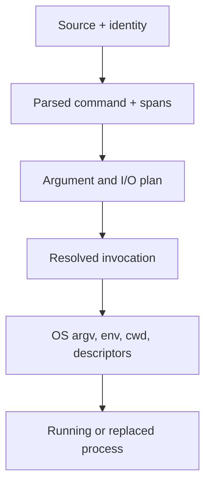
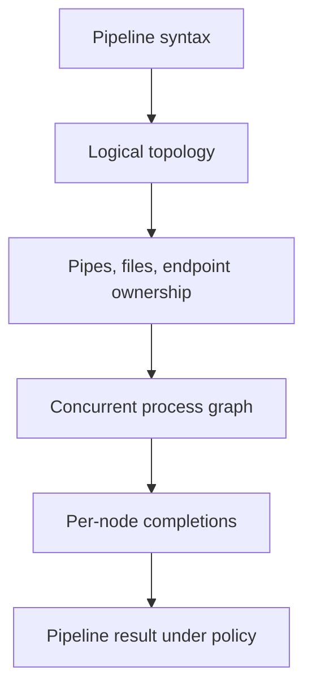
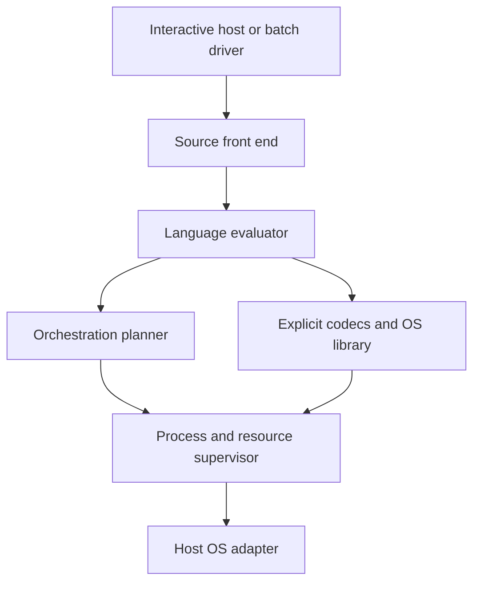

# `ish`: shell semantics and architecture before syntax

Research report, 7 September 2026

## Scope and finding

This report treats `ish` as a shell-design investigation that may put useful pressure on Idriç. It does not assume facilities that Idriç does not have, and it does not use Adriç, Odriç/0driç, or Oodriç as architectural answers. The older `ish` prose that couples the shell to Odriç is project history, not present direction.

The central finding is:

> A shell is a staged boundary machine. It turns source-level command descriptions into operating-system invocations and process graphs, arranges their byte channels and inherited resources, and turns asynchronous OS outcomes back into language-level control and diagnostics.

The Bourne family makes this job look like string macro processing because it represents too many intermediate meanings as strings and then recovers the lost distinctions with quoting, rescanning, splitting flags, and contextual rules. `rc` proves that one better representation—lists of argument strings—removes a remarkable amount of that machinery. Oils proves both how expensive exact Bourne compatibility is and how much cleaner evaluation becomes when cardinality is explicit and source is parsed once. `es` and scsh show that command plans and OS operations can be genuine program values or library operations, but also show the cost of making every shell service higher-order. Elvish and Nushell prove that structured pipelines solve real parsing and schema problems, while also exposing a second, substantial protocol and conversion problem at every external-command boundary.

The most promising direction for `ish` is therefore not “a better POSIX shell” and not “objects everywhere.” It is a small command language over a deliberately explicit orchestration runtime:

- parse once and retain source identity;
- make argument cardinality explicit;
- keep code, text, bytes, patterns, paths, command references, process plans, running processes, and completions distinct where operations differ;
- keep ordinary Unix byte streams as the default inter-process waist;
- make decoding, framing, globbing, command lookup, environment export, and status projection named transformations;
- model process and descriptor lifetime precisely inside the runtime, without necessarily exposing every runtime object in the language;
- keep the interactive terminal program outside the core evaluator.

That is a research conclusion, not an architectural commitment.

## Evidence status: what the `ish` branch actually says

The `ish` branch is much less designed than its README sounds. At head commit [`00160a3`](https://github.com/isomorphisms/grease/commit/00160a3d41ad30900d32f1b6953922e171466bb7), it contains four text files and a pinned Oils-derived source tree. The substantive shell document is [`docs/000-one-command.md`](https://github.com/isomorphisms/grease/blob/ish/docs/000-one-command.md). The source pin is Oils commit [`e9a54ad`](https://github.com/isomorphisms/oils/commit/e9a54ad727d89cd593d0bfe56136046808ea81d2), whose Grease-specific change is startup/tracing cleanup, not a new shell semantic model.

The two `ish`-specific commits make the evidentiary order unusually clear: [`78ffc75`](https://github.com/isomorphisms/grease/commit/78ffc75f3238216b5edec1bbacfd041fbac05ac6) supplies the naming and lineage prose, while [`00160a3`](https://github.com/isomorphisms/grease/commit/00160a3d41ad30900d32f1b6953922e171466bb7) supplies the one-command milestone. Earlier branch history pins and documents the Grease substrate but specifies no additional `ish` semantics. Under the present project boundaries, the milestone document is therefore the branch's only semantic specification; the README is historical intent.

The later Grease archaeology on `main` is useful corroborating evidence. [`docs/CURRENT-GREASE.md`](https://github.com/isomorphisms/grease/blob/main/docs/CURRENT-GREASE.md) records one small semantic change—readable aliases for existing boolean command tokens—plus runtime cleanups. It explicitly labels the Ithon/ICKY experiments and ten idea branches as experimental or unimplemented. Those branch names are not architectural decisions.

### Decisions, milestone constraints, and placeholders

| Branch statement | Status for this investigation | Architectural meaning |
|---|---|---|
| No Oils/YSH, Bourne, or POSIX compatibility contract | Actual direction | Compatibility behavior is evidence, not a requirement. |
| A parsed `SimpleCommand` retains a whole-command span and a span for each source word | Actual milestone decision and strong general precedent | Source identity survives parsing and can anchor later errors. |
| Each source word becomes exactly one process argument | Milestone-zero constraint, not yet a permanent language rule | The first executable slice deliberately avoids expansion ambiguity. It does not decide the eventual list/splice model. |
| Source text and bytes passed to the OS are distinct | Actual boundary decision | Encoding or lossless byte representation must be designed rather than hidden. |
| The program is an explicit relative or absolute path; no `PATH` search | Milestone-zero constraint | Command resolution is postponed, not answered. |
| Build `argv`, inherit environment/current directory/descriptors 0–2, then call `execve` directly | Actual milestone behavior | Milestone zero is process replacement, with no shell process left to wait. It does not decide the later process model. |
| Launch failure reports operation, path, source span, and OS error | Actual quality bar | Errors should describe the transformation boundary that failed. |
| Quoting, variables, expansion, globbing, multiple commands, fork/wait, redirection, pipelines, lookup, builtins, functions, control flow, signals, prompt, and job control | Explicitly deferred | None has a settled `ish` model. |
| Processes, pipes, HTTP/utility orchestration, files, temporary paths, build commands, and OS boundaries serve IB-related work | Use-case inventory | This says what work should eventually be expressible; it does not make HTTP, IB, or build concepts shell primitives. |
| The README’s Odriç implementation and co-design claims, and `odric.lock` | Stale project coupling under the present brief | They must not constrain the shell model. The current language context is Idriç, but this report assumes no new Idriç facility. |
| Typographical mathematics and vector-indexed names in the [`ish` README](https://github.com/isomorphisms/grease/blob/ish/README.md) | Imported older language-direction prose, not established shell semantics | They provide no evidence about arguments, processes, descriptors, failure, or interaction and are set aside here. |

The strongest existing `ish` choice is methodological: begin at a real semantic boundary and make one complete transition observable. The weakest part of the branch is that nearly everything after `execve` remains a noun in prose rather than a specified object or transformation.

---

## 1. What a shell fundamentally does

### Conclusion: a shell constructs and supervises effectful invocations

Stripped of historical syntax, a shell has four essential responsibilities.

1. **Describe computation at an OS boundary.** It constructs an executable identity, an argument vector, an environment, a working directory, and an inherited descriptor arrangement. On Unix, `execve` ultimately accepts a pathname, a null-terminated vector of non-NUL byte strings, and a null-terminated environment vector; successful execution replaces the current process image rather than returning ([Linux `execve(2)`](https://man7.org/linux/man-pages/man2/execve.2.html)).

2. **Compose concurrent computations through resources.** It creates pipes, opens files, duplicates and closes descriptors, starts processes, closes unused endpoints, and waits for a set of possible outcomes. A source-level pipe is not the kernel pipe, and neither is the set of running processes.

3. **Maintain a session context.** A long-lived shell owns at least some combination of a current directory, an exported environment view, command definitions, and—when interactive—a process/job table and terminal foreground state. Some state is essential because a child cannot change its parent’s directory or environment; much additional global state is historical convenience.

4. **Reconcile two semantic worlds.** Inside the language there may be text, lists, records, closures, structured errors, and predicates. Across an ordinary Unix process boundary there are path bytes, `argv`, `envp`, descriptor numbers, byte streams, PIDs, signals, and wait statuses. A sound shell makes each lowering and lifting operation visible in its architecture.

A prompt, a programming language, glob syntax, and a library of convenience commands are all useful shell components, but none is the defining core. Scsh made this separation unusually plain: Olin Shivers described it as two components, a high-level process-control notation and a full Unix system-call library, while explicitly declining to solve job control, history, or line editing in the original scripting design ([*A Scheme Shell*, §§2–3](https://publications.csail.mit.edu/lcs/pubs/pdf/MIT-LCS-TR-635.pdf)).

### The shell’s narrow waist

There are really two waists:

- **Invocation waist:** resolved executable + `argv` + exported environment + current directory + inherited descriptors.
- **Streaming waist:** file-descriptor endpoints carrying bytes, with EOF/backpressure/lifetime semantics.

Unix’s success comes partly from these waists being small. Andy Chu’s later YSH design calls Oils “exterior-first”: it can have rich values internally while retaining files and Unix-facing representations as the durable composition boundary ([“Oils Is Exterior-First”](https://www.oilshell.org/blog/2023/06/ysh-design.html)). That is a more useful model for `ish` than equating “modern” with “object pipeline.”

## 2. Which complexity is inherent, and which is an accident

### Conclusion: concurrency and resource lifetime are inherent; phase-coupled word expansion is not

| Problem | Inherent to shell orchestration? | Why |
|---|---:|---|
| Turning a command description into `argv`/environment/path/descriptor actions | Yes | The OS boundary demands concrete representations and failure can occur at each conversion. |
| Starting several processes, closing the right pipe ends, avoiding leaks/deadlocks, and collecting every completion | Yes | This follows from concurrent processes and finite kernel resources. |
| Signals, stopped/continued children, process groups, and foreground terminal ownership | Yes for a job-controlling interactive shell | These are kernel/terminal protocols, not grammar accidents. |
| Distinguishing launch failure, normal exit, signal termination, stop/continue, and pipeline-wide completion | Yes | The OS produces distinct events even if a traditional shell flattens them. |
| Byte-stream framing and decoding | Yes | Bytes do not intrinsically say “lines,” “UTF-8,” “JSON,” or “one value.” |
| Filesystem races between lookup and use | Yes | Resolution observes a mutable external system. A pre-resolved path can still fail at `exec`. |
| Every expansion carrying quoted/unquoted state | No | It compensates for implicit splitting and globbing. |
| Variable expansion changing one source word into zero, one, or many arguments according to quoting context | No | `rc`, YSH, Elvish, and Nushell all demonstrate cleaner cardinality choices. |
| Repeatedly parsing strings for aliases, `eval`, trap bodies, prompts, arithmetic, or indirect expansion | Mostly no | Compatibility requires much of it; a clean language can represent code as code and omit textual aliasing/eval. |
| `$*` versus `$@`, quoted `$@` special cases, and empty-argument elision | No | These arise from string variables trying to encode argument vectors. |
| Command substitution silently deleting trailing newlines and then field-splitting | No | Capture, decoding, trimming, and splitting can be separate operations. POSIX requires the historical behavior ([POSIX shell command substitution](https://pubs.opengroup.org/onlinepubs/9799919799/utilities/V3_chap02.html#tag_19_06_03)). |
| `set -e` exceptions depending on whether evaluation occurs in a condition, pipeline position, or negation | No | It is an after-the-fact control policy over an overloaded status channel. Oils documents how the evaluator must propagate contextual suppression flags ([Oils error-handling notes](https://github.com/isomorphisms/oils/blob/e9a54ad727d89cd593d0bfe56136046808ea81d2/doc/error-handling.md)). |
| Dynamic scope for ordinary shell functions | No | It is inherited behavior; YSH procedures and `es` closures demonstrate lexical alternatives. |
| Some commands having to run in the shell process | Yes | `cd`, session-variable mutation, trap installation, and job-table operations cannot have their intended effect in a disposable child. |
| A long precedence ladder among keywords, special builtins, functions, regular builtins, hashes, and external commands | No | It is a compatibility namespace. A clean design still needs resolution, but not that exact ladder. |

Dash is the useful control specimen. Its source is disciplined and compact, yet its parser embeds control markers in word strings, and `expand.c` must carry region metadata through substitution, field splitting, quote removal, and pathname expansion. Its evaluator carries “tested context” flags so `-e` behavior changes according to AST position. This is not accidental implementation mess: it is a compact implementation of required historical semantics. The [dash architecture tour](https://kernel.googlesource.com/pub/scm/utils/dash/dash/+/refs/tags/v0.5.13/src/TOUR), [`expand.c`](https://kernel.googlesource.com/pub/scm/utils/dash/dash/+/refs/tags/v0.5.13/src/expand.c), and [`eval.c`](https://kernel.googlesource.com/pub/scm/utils/dash/dash/+/refs/tags/v0.5.13/src/eval.c) make the cost visible.

## 3. The strongest lessons from Oils / OSH / YSH

### Conclusion: copy the boundaries Oils discovered; do not copy the compatibility machinery that forced their discovery

Oils is the most useful corpus because OSH implements real shell compatibility, YSH relaxes it, and both share an architecture. The pinned Grease source therefore contains an unusually direct controlled experiment.

### Parsing: preserve source, name the sublanguages, parse once

Oils keeps a lossless token stream and source locations rather than throwing spelling and position away. Its syntax schema distinguishes tokens, word parts, redirects, pipelines, subshells, and compound commands ([`frontend/syntax.asdl`](https://github.com/isomorphisms/oils/blob/e9a54ad727d89cd593d0bfe56136046808ea81d2/frontend/syntax.asdl)). This supports diagnostics, formatting, translation, completion, and errors that still point at the source construct after several transformations.

Its parser is explicitly modal. Command words, arithmetic, boolean expressions, and YSH expressions have different lexical/grammatical expectations; transitions are represented rather than hidden ([command versus expression mode](https://github.com/isomorphisms/oils/blob/e9a54ad727d89cd593d0bfe56136046808ea81d2/doc/command-vs-expression-mode.md)). “One lexer mode” is not a worthwhile simplicity goal if the language genuinely has several sublanguages. The simplicity goal is that mode transitions be syntactic, local, and inspectable.

More important is Oils’ audit of reparsing. Here-documents, backticks, aliases, prompts, `eval`, traps, and sourced text all create extra parse boundaries in compatible shells; Bash adds recursive arithmetic and forms of indirect expansion. Oils records these explicitly in its [parser architecture notes](https://github.com/isomorphisms/oils/blob/e9a54ad727d89cd593d0bfe56136046808ea81d2/doc/parser-architecture.md). For `ish`, the implication is stronger: runtime parsing should exist only at an operation explicitly about loading or evaluating source. Command values should retain parsed code. Traps should retain callable code. Textual aliases should not be a hidden second parser entry.

### Word evaluation: cardinality is the real issue

The compatible OSH word evaluator is necessarily staged and context-sensitive. The syntax tree preserves literals, quote nodes, variable/command/arithmetic substitutions, arrays, braces, tilde, extglobs, and splices, while runtime pieces carry whether they were quoted and whether they should later split ([`osh/word_eval.py`](https://github.com/isomorphisms/oils/blob/e9a54ad727d89cd593d0bfe56136046808ea81d2/osh/word_eval.py), [`core/runtime.asdl`](https://github.com/isomorphisms/oils/blob/e9a54ad727d89cd593d0bfe56136046808ea81d2/core/runtime.asdl)). Those booleans are compatibility debt encoded as dataflow.

YSH’s “Simple Word Evaluation” is the clean alternative. Ordinary substitution produces one argument, including an empty one; a list becomes several arguments only through an explicit splice; splitting, optional elision, and globbing are explicit operations ([design note](https://github.com/isomorphisms/oils/blob/e9a54ad727d89cd593d0bfe56136046808ea81d2/doc/simple-word-eval.md), [Chu’s explanatory essay](https://www.oilshell.org/blog/2021/04/simple-word-eval.html)). This removes the need for quotes to act as a dynamic switch over later phases.

The key lesson is not YSH’s spelling. It is the invariant:

> At every argument-construction node, the evaluator should know whether the node contributes exactly one argument or explicitly splices a sequence.

Globbing is then an operation returning matched paths, not an ambient phase that happens to unquoted strings. Command substitution is capture plus an explicit framing/decoding policy, not textual paste followed by the ordinary word algorithm. Empty list and one empty argument remain different.

### Command and expression languages should meet at explicit transitions

Oils recognizes that command invocation has a useful uniform shape—an argument vector and I/O context—while expression evaluation has ordinary value semantics. YSH consequently distinguishes command-like procedures from value-returning functions ([procedure/function design](https://github.com/isomorphisms/oils/blob/e9a54ad727d89cd593d0bfe56136046808ea81d2/doc/proc-func.md)). That distinction is more important than the exact two namespaces or return mechanisms.

For `ish`, it argues against pretending that every command is merely a function returning a value, or that every function is merely an external-style command. The two can share names or syntax later, but their contracts and effects should be explicit in the semantic model.

### Execution: a command value is not yet a process

Oils lowers a simple command to a `cmd_value.Argv` or assignment form before execution. Its executor then resolves assignment builtins, special builtins, procedures, normal builtins, and external programs; external execution separately performs path lookup, environment materialization, fork/exec decisions, and error mapping ([`core/executor.py`](https://github.com/isomorphisms/oils/blob/e9a54ad727d89cd593d0bfe56136046808ea81d2/core/executor.py)). Its process layer distinguishes thunks, `Process`, `Pipeline`, `Job`, job control, descriptor state, and a waiter registry ([`core/process.py`](https://github.com/isomorphisms/oils/blob/e9a54ad727d89cd593d0bfe56136046808ea81d2/core/process.py)).

This is strong architectural evidence for a plan/lifecycle split:

- parsed command;
- evaluated invocation request;
- resolved command target;
- launch plan;
- running process/job;
- completion.

It does **not** follow that all six must be public language types. They must at least remain distinguishable inside the implementation.

Oils also documents where shell syntax silently creates processes: command substitution, subshell syntax, pipelines, backgrounding, and sometimes functions in pipeline positions ([process model](https://github.com/isomorphisms/oils/blob/e9a54ad727d89cd593d0bfe56136046808ea81d2/doc/process-model.md)). A clean `ish` should make execution placement predictable; whether a callable runs in the session process, a forked child, or an external image is semantically observable whenever it mutates state.

### Status and failure: retain the information before choosing policy

Oils’ error analysis is especially valuable. `$?` stores one integer even though a pipeline and its process substitutions can produce several statuses; `if` treats a nonzero status as false even when it represents failure; `errexit` then tries to recover error propagation from syntactic context. YSH’s `try` retains structured error details, pipeline statuses, and process-substitution statuses, and provides an explicit status-to-boolean assertion ([error-handling design](https://github.com/isomorphisms/oils/blob/e9a54ad727d89cd593d0bfe56136046808ea81d2/doc/error-handling.md)).

The transferable rule is: retain a structured completion first; project it to a boolean or Unix exit code only at a named boundary. Oils’ precise YSH error surface need not be copied.

### State: Oils shows the danger as well as the solution

Oils’ `Mem` and option objects centralize variable stacks, exported cells, arguments, current directory, status registers, traps, options, and interactive state so several evaluators and builtin groups can share them ([interpreter state](https://github.com/isomorphisms/oils/blob/e9a54ad727d89cd593d0bfe56136046808ea81d2/doc/interpreter-state.md), [`core/state.py`](https://github.com/isomorphisms/oils/blob/e9a54ad727d89cd593d0bfe56136046808ea81d2/core/state.py)). That is understandable for a dual OSH/YSH interpreter, but it is also a warning. A clean shell should not begin with a universal mutable shell object merely because a compatible shell eventually needs one.

Use smaller explicit contexts: language bindings, invocation environment, process supervisor, and interactive session state. Let stateful operations request the particular capability they mutate.

### What not to copy from Oils

- OSH’s quote/split flags, staged word expansion, dynamic scope, `errexit` contexts, builtin precedence, and implicit subshell rules exist primarily for compatibility.
- Combining a highly compatible shell and a clean language in one binary yields architectural reuse, but also a large option/state surface that `ish` does not need.
- YSH’s broad tagged object model, multiple procedure return idioms, reflection, and extensive builtins are evidence that rich values can coexist with Unix—not evidence that `ish` needs the same runtime.
- Capture helpers that strip trailing newlines or choose an encoding are still conversions. They should not become an invisible definition of “command result.” Oils’ own [I/O design notes](https://github.com/isomorphisms/oils/blob/e9a54ad727d89cd593d0bfe56136046808ea81d2/doc/ysh-io.md) emphasize framing and filename/encoding hazards.

Andy Chu’s retrospectives are useful caution against reading a successful end state as an obvious path: he describes Oils as a set of experiments that kept working, sometimes only on a second design, and says the difficulty of a good YSH was underestimated ([2024 project retrospective](https://www.oilshell.org/blog/2024/09/retrospective.html), [2021 architecture retrospective](https://www.oilshell.org/blog/2021/12/review-arch.html)). `ish` should borrow validated invariants, not Oils’ accumulated surface area.

## 4. The strongest lessons from `rc`

### Conclusion: choose the argument representation first, and much of “shell quoting” disappears

Tom Duff identifies `rc`’s principal difference directly: variables hold flat lists of argument strings, not strings pretending to contain word lists. Unset is the empty list; one empty string is a one-element list; expansion substitutes list elements without reparsing them ([*Rc—The Plan 9 Shell*, §§5–9](https://pdos.csail.mit.edu/6.828/2007/readings/rc-shell.pdf)).

That one choice eliminates or simplifies:

- the ordinary need for field splitting after variable substitution;
- the `$*`/`$@` distinction and the special quoted behavior of `$@`;
- the disappearance of empty arguments as a side effect of unquoted expansion;
- strings that must be rescanned to rediscover their intended elements;
- two large families of quoting rules whose purpose is only to suppress splitting and pathname expansion.

`rc` still has quoting, but quoting primarily marks literal syntax characters. It is no longer the general-purpose brake on a multi-stage macro engine.

### Argument construction is algebra, not a bag of phases

An `rc` command position accepts a list of strings. Adjacent components concatenate; concatenation is pairwise when list lengths agree and distributes when one side is a singleton. Thus list-valued variables construct argument vectors directly. The [manual’s Arguments and Variables section](https://9fans.github.io/plan9port/man/man1/rc.html) specifies both list substitution and concatenation rules.

This is a profound improvement over Bourne expansion, but it is not automatically the best algebra for `ish`. Distributed concatenation is concise for adding a suffix to many names; it can also make cardinality less locally obvious. YSH and Nushell instead make list splicing explicit. The evidence supports list-valued argument construction, not one mandatory concatenation algebra.

### `rc`’s whole model, not just its variables

| Area | `rc` model | What it teaches |
|---|---|---|
| Values | Flat lists of strings; no nested lists | Match the dominant `argv` boundary and preserve empty-list/empty-argument distinction. Rich recursive data is not required for a useful shell. |
| Patterns | Unquoted pattern-bearing arguments expand after other argument operations; an unmatched pattern remains literal | Keeping a pattern distinguishable until filesystem matching is good. Silent unmatched-pattern identity is convenient but can hide errors. |
| Command substitution | Captures stdout and splits it using `$ifs` | This is the major residual word-splitting seam. `rc` did not fully separate capture from framing. |
| Functions | Command-like functions receive the remaining argument list in `$*`; function lookup precedes builtin/path lookup | A reusable command can naturally consume an argument vector, but `rc` still gives it ambient dynamic state and status output. |
| Environment | List variables and functions are exported in an encoding recoverable by another `rc`; the Unix port uses SOH between list elements and mirrors `path`/`PATH` | A rich shell value is not automatically an interoperable process environment value. The environment boundary needs an explicit codec or a restricted exported subset. |
| Status | Plan 9 commands return an empty success message or descriptive failure string; a pipeline concatenates component statuses | `rc` preserves more pipeline information than a single last-stage integer, but still overloads status as condition and message. |
| Redirection | Open, append, descriptor duplication, close, and pipe descriptor selection are explicit and evaluated left-to-right | Ordering is semantic because descriptor actions transform a table; model the action sequence, not just its final integers. |
| Pipelines | Linear pipes plus process-substitution forms for some non-linear trees | The source form denotes topology. The paper correctly warns that more general graphs can deadlock or require unbounded buffering. |
| Process/session behavior | Foreground commands update status; background commands expose a PID; `exec` replaces the shell; state-changing commands are builtins | The basic lifecycle distinctions remain necessary even in a much cleaner word language. |

The environment point is frequently missed. Native Plan 9 exposes each environment value as a file under `/env`, with NUL-terminated list components and copy/share behavior controlled by `rfork`; commands can mutate a shared environment group ([Duff, §23](https://pdos.csail.mit.edu/6.828/2007/readings/rc-shell.pdf)). Plan 9 from User Space must instead serialize a list into a Unix `name=value` entry and maintain special `path`/`PATH` synchronization ([`rc(1)`, Environment and Special Variables](https://9fans.github.io/plan9port/man/man1/rc.html)). `rc`’s clean variable model is partly supported by its native OS.

### Where `rc` stops short

- Command substitution still turns unframed bytes into arguments through ambient `$ifs`.
- Patterns are still triggered by source quoting state and unmatched patterns survive as their original strings.
- Lists are flat because `argv` is flat; this is excellent for commands but insufficient as a general application data model.
- Function parameters and ordinary variables use dynamic conventions rather than a clean lexical value language.
- `eval` remains an escape that reparses a reconstructed string; Duff’s own `man` example uses it to delay a pattern, showing that a pattern value was missing ([paper, §26](https://pdos.csail.mit.edu/6.828/2007/readings/rc-shell.pdf)).
- Status remains both data and truth.

The correct answer to “what complexity disappears because `rc` chose a better underlying representation?” is: most ordinary expansion complexity. Process, descriptor, status, framing, and interactive complexity remain.

## 5. What `es` learned by extending `rc`

### Conclusion: first-class code and a procedural core are strong; universal higher-order shell machinery crosses the Unix boundary badly

Paul Haahr and Byron Rakitzis started with `rc`’s list semantics and generalized the shell toward lexical scope, closures, first-class code, rich return values, exceptions, and overridable shell services. Their paper is unusually candid about both the gain and the cost ([*Es: A shell with higher-order functions*](https://wryun.github.io/es-shell/paper.html)).

### Useful generalizations

- **Code is represented as code.** Lambdas/closures can be passed without serializing command text and fighting nested quotation. This is the sound answer to callbacks, deferred commands, and traps.
- **Lexical scope is real.** Closures capture bindings; ordinary reusable code is not forced into the caller-sensitive dynamic scope of traditional shell functions.
- **Surface forms lower to operations.** Redirection is rewritten to a call that receives a descriptor, path, and command closure; pipeline construction and path lookup have procedural foundations. This is evidence for a small semantic core below convenient notation.
- **The interactive loop can be a client.** `es` implements its default loop in `es` using prompt, parse, error handling, and evaluation hooks, demonstrating that the REPL is not identical to the evaluator.
- **Shell services can be instrumented.** The paper’s pipeline-timing example shows the benefit of representing pipeline construction at a boundary that tools can observe.

### Where generalization became complication

`es` makes most surface syntax call overridable hook functions backed by unspoofable primitives. This is powerful, but it makes the meaning of fundamental operations globally replaceable. Path caching, redirection safety, remote pipeline execution, prompting, and command-not-found behavior can all become arbitrary user code. That is an extensibility system, a security boundary, a debugging policy, and a performance model—not merely a small shell core.

The Unix seam is more decisive. The authors report that:

- rich return values from in-process functions cannot cross `exit`/`wait`, forcing some facilities to become builtins;
- exceptions raised in a subshell cannot propagate as exceptions, so they collapse to a printed message plus false status;
- exporting closures requires unparsing code plus lexical environment into environment strings;
- shared lexical relationships are broken when closures are exported separately to subshells;
- preserving the same call semantics for functions and external programs led `es` to flatten all lists to `argv` shape;
- recursive first-class structures required garbage collection and pervasive root tracking;
- the parser mixed recognition of the core with lowering of shell sugar, which the authors call one of the least satisfying parts.

These are not retrospective guesses; they are the paper’s own [Interactions With UNIX, Garbage Collection, Future Work, and Conclusions](https://wryun.github.io/es-shell/paper.html#interactions-with-unix). The conclusion explicitly says that exceptions and rich returns do not interact with Unix as well as hoped.

### Architectural evidence for `ish`

Keep three `es` ideas:

1. callable code should not be passed as source strings;
2. convenient shell forms should lower to a small, inspectable orchestration core;
3. the evaluator should offer narrow observation/instrumentation boundaries.

Do not infer that every primitive must be overrideable, every command must return any value, or the shell must be a higher-order object system. `es` is the best primary-source warning that elegance inside one process can become forced serialization, builtins, and semantic collapse at a Unix process boundary.

## 6. What scsh teaches about modeling Unix directly

### Conclusion: give OS operations program-level descriptions, but retain the difference between descriptions, live resources, and adapters

Scsh’s greatest contribution is not Scheme syntax. It is a layered account of Unix operations.

An **extended process form** combines a process form with redirection specifications. Process forms describe Scheme code to run in a fork, an external program, a linear pipeline, a complex descriptor-connected pipeline, or a nested extended form. Redirections describe open-for-read, create/truncate, append, here input, descriptor duplication, closing, and standard-port installation. Separate operations then execute in place, fork asynchronously, or fork and wait ([*A Scheme Shell*, §3](https://publications.csail.mit.edu/lcs/pubs/pdf/MIT-LCS-TR-635.pdf)).

This gives a clean conceptual sequence:

`process description + I/O description → launch operation → process identity → wait operation → decoded completion`

Every high-level form has a procedural foundation. Pipelines reduce to pipe creation plus fork; redirections reduce to open/dup/close; run reduces to fork plus wait. This makes the notation optional and the OS library reusable. It is compelling evidence for keeping `ish` syntax above an orchestration API rather than embedding system calls directly throughout an evaluator.

### Capture is an adapter, not command return

Scsh provides distinct adapters that collect a process’s stdout as a port, string, list of strings, s-expression, list of s-expressions, or temporary file. This makes two facts explicit:

- a child fundamentally writes bytes;
- choosing to buffer, decode, split into lines, or parse a datum is a separate operation.

That is a stronger model than both Bourne command substitution and `rc`’s `$ifs` split. It also preserves a streaming option—the port—rather than always materializing output.

### Ports and descriptors expose a real semantic mismatch

Scsh’s manual devotes substantial machinery to the relationship between Scheme ports and Unix file descriptors. A port is a garbage-collected language object with buffering and ownership; a descriptor is a small process-local integer inherited across fork/exec. Revealing a port’s descriptor can cause premature close unless the runtime maintains a reveal count and an explicit release protocol ([*Scsh Reference Manual*, §§2.1.1 and 3.2.4–3.2.5](https://carlstrom.com/publications/scsh-manual.pdf)).

This is exactly the primitive-representation lesson: an integer is the kernel representation of a descriptor slot, not the whole semantics of a readable stream handle. But scsh also shows the danger of hiding the integer completely—duplication, inheritance, and exec operate on descriptor slots. `ish` should use semantic handles/plans in ordinary runtime code and lower them to descriptor numbers in one OS layer.

### Other useful distinctions

- Raw `wait` status is decoded into normal exit, stop signal, or termination signal. A tagged completion is already latent in the Unix API.
- Environment and current-directory changes have scoped `with-...` operations, showing that ambient state can be presented through explicit dynamic extent.
- Signals are named operations rather than arbitrary integers at most call sites.
- Full syscall access remains available when high-level process forms are insufficient.

### What not to copy

Scsh sometimes coerces Scheme symbols and numbers to strings when building external arguments. That convenience hides precisely the conversion `ish` should audit. Its original design intentionally omits a serious interactive shell. Raw PIDs and many descriptor positions remain integers. And embedding process notation in a full Scheme gives far more language than a thin orchestration shell necessarily needs. The architectural lesson is the procedural substrate and explicit adapters, not Scheme as a prerequisite.

## 7. What a small Bourne shell teaches

### Conclusion: small implementation architecture cannot make compatibility semantics small

Almquist shell and dash are valuable controls because they do not carry Bash’s enormous interactive and extension surface. Dash still has a recognizable, disciplined decomposition:

| Module | Broad responsibility |
|---|---|
| `parser.c` and syntax tables | Recursive-descent command parser and context-specific lexical classes |
| `expand.c` | Parameter, command, arithmetic, tilde, field, pathname, and quote processing |
| `eval.c` | Tree-walking command evaluator and control-flow/status policy |
| `exec.c` | Command lookup, hashing, builtin/function/external selection, and exec errors |
| `redir.c` | Ordered descriptor actions and scoped save/restore |
| `jobs.c` | Forking, process groups, waiting, job records, and terminal control |
| `var.c` | Shell variables, exported `name=value` representation, local/temp bindings |
| `trap.c` | Signals and trap dispatch |
| `histedit.c` | Interactive history and line-editor integration |

The source-level separation is good. The [Almquist architecture tour](https://kernel.googlesource.com/pub/scm/utils/dash/dash/+/refs/tags/v0.5.13/src/TOUR) describes a recursive-descent parser, syntax trees, expansion, evaluation, jobs, redirection, and variables in almost exactly these layers. `ish` can learn from that modularity without copying its semantic data structures.

The revealing part is the representation inside the layers. Dash encodes control markers for variable expansion, command substitution, quoting, and escapes inside the character buffer of an argument node. `expand.c` later interprets those markers and records which byte regions are eligible for IFS splitting. Quoted `$@` needs special treatment because it is simultaneously inside one syntactic word and semantically several arguments. This is a compact implementation, but the “string” is not honestly a string: it is a private bytecode plus side tables.

The evaluator likewise cannot merely recurse over an AST. It must know whether a command occurs in a tested context so that nonzero status does or does not trigger `-e`; pipelines and negation change that context. [`eval.c`](https://kernel.googlesource.com/pub/scm/utils/dash/dash/+/refs/tags/v0.5.13/src/eval.c) and POSIX’s [`-e` rules](https://pubs.opengroup.org/onlinepubs/9799919799/utilities/V3_chap02.html) show the semantic source of those flags.

### What is genuinely reusable

- **Parser, expansion, execution, redirection, jobs, and interaction are separate subsystems.** Even a tiny shell benefits from those boundaries.
- **Redirection is an ordered transaction over a descriptor table.** Dash pushes saved descriptors before applying actions and restores them afterward. The order cannot be reduced to a map because duplicate-before-open and open-before-duplicate differ ([`redir.c`](https://kernel.googlesource.com/pub/scm/utils/dash/dash/+/refs/tags/v0.5.13/src/redir.c)).
- **Command lookup is a runtime operation.** Dash distinguishes names containing slash, `PATH` search, cached results, builtins, and functions; it maps “found but not executable” separately from “not found” ([`exec.c`](https://kernel.googlesource.com/pub/scm/utils/dash/dash/+/refs/tags/v0.5.13/src/exec.c)).
- **Builtin invocation can share the final argument-vector convention.** That is a useful common waist. It does not mean builtins and external processes have identical effects.
- **Job control belongs next to process supervision.** It needs PIDs, process groups, wait events, and terminal operations, not just parser support ([`jobs.c`](https://kernel.googlesource.com/pub/scm/utils/dash/dash/+/refs/tags/v0.5.13/src/jobs.c)).

### What is compatibility cost

- encoded quote/split state flowing through expansion;
- dynamic scope and temporary-assignment corner cases;
- the POSIX command-resolution precedence ladder;
- implicit forks/subshells that determine whether mutations persist;
- command substitution’s trailing-newline deletion;
- last-status global registers and contextual `errexit`;
- trap bodies and `eval` as reparsed strings;
- shell functions transported through shell-specific environment encodings.

Dash therefore falsifies a tempting argument: “the language cannot be the problem because a small shell implements it in little code.” Its source is comprehensible by discipline; the semantic state space remains large. `ish` should seek decisions that make dash’s expansion state machine unnecessary, not merely a shorter version of it.

## 8. What Plan 9 and the suckless environment actually buy

### Conclusion: a simple shell is easier when the surrounding OS and commands share its representations

`rc` did not arise in an ordinary Unix environment. Plan 9 makes three surrounding choices that matter to shell design:

1. resources are named and accessed through files;
2. a uniform 9P protocol carries file operations;
3. each process can have its own composed namespace, including union directories.

Those are the organizing principles of the original [Plan 9 paper](https://9p.io/sys/doc/9.pdf). A process can copy or share namespace, environment, descriptor, and note groups independently through `rfork`; `rc` exposes those operations directly. Program directories can be bound into a union `/bin`, so a typical `rc` path is simply `(. /bin)` rather than a long global colon-encoded search string. The environment itself is a file namespace capable of preserving list components.

This buys real semantic simplicity:

- fewer ad hoc configuration registries because resources share file operations;
- a smaller and more local command-search model;
- composable per-process views instead of one global filesystem view;
- an environment representation aligned with `rc`’s list values;
- less shell-side adaptation between unrelated interfaces.

But the dependency is partial, not total. Arguments are still flat strings, pipes still carry bytes, programs still invent data formats, and process lifetime remains. The Unix port of `rc` is instructive: it keeps the clean list language, but adds special environment serialization, `path`/`PATH` mirroring, `/dev/fd` dependencies, and Unix process conventions. The [Plan 9 from User Space `rc(1)` manual](https://9fans.github.io/plan9port/man/man1/rc.html) documents each seam.

[9base](https://tools.suckless.org/9base/) is useful for the same reason. It ports a deliberately small Plan 9 command environment, including `rc`, onto Unix. It demonstrates that the language and tool ecosystem can travel together, but the adapter layer does not disappear.

### The relationship to small tools

Delegating to external programs simplifies a shell only when the delegated interface is itself small and stable. A program that accepts a clear `argv`, reads and writes bytes predictably, and reports failure consistently is an excellent shell component. A program that emits presentation-oriented text, depends on ambient locale, and overloads exit status merely moves parsing and policy into every caller.

Structured shells correctly diagnose this second case. Their mistake would be to conclude that all composition therefore belongs inside one object runtime. Another answer is an ecosystem of narrow byte protocols plus explicit codecs. Oils describes this as a narrow waist; the original Unix/Plan 9 answer is small commands over files and streams.

The [suckless philosophy](https://suckless.org/philosophy/) is most valuable here as a design test, not a source-format prescription. For `ish`, simplicity should mean fewer representable invalid states and fewer implicit conversions. Short code is a likely consequence only when the semantic surface is actually smaller.

### Consequences for the current `ish` use cases

HTTP orchestration, temporary files, builds, and IB interaction should initially be treated as clients of shell primitives, not evidence for built-in HTTP or build objects. Delegation remains simple if the boundary exposes:

- exact arguments and environment;
- byte streams or file handles;
- explicit capture/decoding;
- structured launch/completion errors;
- deliberate temporary-path lifetime.

If repeated real programs show that an external protocol cannot express a needed invariant, that is later evidence for a library or semantic addition. It is not a reason to pre-load the shell core with application concepts.

## 9. What Elvish and Nushell get right—and make harder

### Conclusion: structured pipelines solve structure loss, but create a second transport world

The real problem they solve is straightforward. A byte pipeline forgets records, field names, number/date types, nulls, nested values, and item boundaries. Each downstream program must parse again, often from human-oriented output. When producer and consumer share an in-process value protocol, filtering a record field is safer than parsing aligned columns; lists and records retain empty values and types; errors can carry spans and fields.

That is a substantial gain for data work. It is not free.

### Elvish: dual channels make the boundary explicit

Elvish has strings, numbers, lists, maps, booleans, exceptions, files, and first-class functions. Its command resolution distinguishes literal command names, callable values, slash-containing external paths, and runtime `PATH` lookup. A dynamic plain string without a slash is not silently treated as a command name ([Elvish language specification, command forms](https://elv.sh/ref/language.html#ordinary-command)). This is an excellent example of preventing a string/command category mistake.

Each Elvish I/O port combines two things: a traditional file carrying bytes and an in-process channel carrying values. A pipeline connects both. External commands receive only the file side; value channels cannot cross `exec` ([specification, I/O ports and pipelines](https://elv.sh/ref/language.html#io-ports)). This design preserves Unix interoperability without pretending that external commands understand objects.

It also exposes the costs:

- every port has two possible media;
- file redirection changes or disables the value side;
- a command can emit values and bytes whose observed ordering is not preserved under capture;
- buffering/backpressure exist independently on both channels;
- top-level display must render values back to text;
- external commands divide the graph into value-aware and byte-only regions.

Elvish’s failure model is stronger than traditional shells. External exit, signal, and stop are structured exception reasons; a pipeline waits for all stages and produces a composite exception if several fail. It contextually suppresses broken-pipe/SIGPIPE failures when a downstream stage has intentionally finished ([specification, exception values and pipeline exceptions](https://elv.sh/ref/language.html#pipeline-exception)). That is compelling evidence for aggregate completion plus policy, independent of whether `ish` adopts value channels.

### Nushell: structure plus streaming is its own runtime architecture

Nushell makes structured pipelines the central model: values include records, tables, lists, binary data, dates, durations, and more, and internal commands transform them directly ([Nushell pipelines](https://www.nushell.sh/book/pipelines.html), [data types](https://www.nushell.sh/book/types_of_data.html)). It also separates source parsing from IR evaluation and deliberately rejects general `eval`-like runtime parsing ([How Nushell Code Gets Run](https://www.nushell.sh/book/how_nushell_code_gets_run.html)). Both are successful answers to real problems.

Its `PipelineData` source is unusually useful design evidence. The current representation has four cases: empty, one concrete value, a stream of values, or a byte stream. The maintainers record two rejected designs. “Everything is a stream” could not preserve one string versus a one-element list or decide when to flatten. Putting a stream inside an ordinary value created aliasing, locking, and non-local consumption effects. The separate cases are the resulting compromise ([`PipelineData` documentation](https://docs.rs/nu-protocol/latest/nu_protocol/enum.PipelineData.html)).

The external boundary then needs serious machinery. Nushell:

- requires explicit list spreading into external arguments, a strong cardinality choice ([running external commands](https://www.nushell.sh/book/running_externals.html));
- turns arguments into platform `OsString` values and expands glob values;
- can hand a byte stream’s OS pipe directly to another external command;
- otherwise creates a pipe and worker thread to copy input;
- renders structured input through its table renderer before feeding an external program;
- wraps external output as a byte stream, which later commands must decode or parse;
- sometimes collects a stream into a value for `$in`, changing memory and latency behavior.

The current [`run_external.rs`](https://github.com/nushell/nushell/blob/main/crates/nu-command/src/system/run_external.rs) explicitly warns that the generic structured-data writer copies unnecessarily for external-to-external pipelines and should be bypassed by handing the pipe through. This is a concrete architectural cost, not an abstract objection.

Nushell’s external-status interface is less unified than its data model: ordinary status is available through `LAST_EXIT_CODE`, while `complete` collects stdout, stderr, and exit code into a record ([stdout, stderr, and exit codes](https://www.nushell.sh/book/stdout_stderr_exit_codes.html)). This reinforces the need to design data transport and process outcome separately.

### Implication for `ish`

`ish` should preserve structured values if and when the language already has a reason for them, but should not make an object pipeline the default inter-process protocol. A lower-cost initial architecture is:

- byte streams and file endpoints between processes;
- ordinary in-process values inside the language/evaluator;
- explicit adapters for text decoding, line framing, JSON or other records, collection, and rendering;
- zero-copy pipe handoff when both neighboring stages are external;
- no claim that presentation text is a canonical serialization.

A future internal value-stream facility can be added if real `ish` programs justify the second protocol. It should then be designed as a protocol—with streaming, ownership, ordering, backpressure, errors, and external conversion—not as “lists flowing through a pipe.”

## 10. Semantic inventory: the things `ish` may actually manipulate

### Conclusion: the useful inventory is richer than primitives, but smaller than an object universe

The names below are conceptual roles, not proposed Idriç declarations. “Expose?” distinguishes things that must exist architecturally from things that necessarily deserve user-visible values.

| Semantic thing | What it means | Operations that justify the distinction | Likely exposure |
|---|---|---|---|
| Source unit | The original script or interactive submission, with an identity and encoding | Parse; retrieve excerpts; diagnose | Tool/runtime object; source text visible |
| Source span | A range in one source unit | Slice source; attach diagnostics; trace transformations | Usually metadata, not ordinary value |
| Token | A lexically classified source slice | Parse; format; complete | Front-end only unless metaprogramming is chosen |
| Word/argument producer | Parsed source whose evaluation contributes one argument or explicitly several | Evaluate under bindings; preserve cardinality and spans | AST/IR object |
| Quoted/literal component | A syntactic component whose characters are literal | Parsing and concatenation | Should disappear after argument construction; not a runtime “quoted string” |
| Pattern | A matching program, not yet a path or ordinary argument | Compile/match; traverse filesystem; report no-match | Possibly visible if matching is a normal operation |
| Command form | Parsed command head, argument producers, I/O clauses, and span | Evaluate to an invocation or internal operation | AST/IR; callable code may be visible separately |
| Compound command / code value | Parsed control structure or delayed command body | Invoke without reparsing; capture lexical bindings if supported | Visible only if callbacks/deferred code require it |
| Redirection description | Ordered request to open, duplicate, move, close, or attach an endpoint | Validate; plan; apply with scoped lifetime | Good runtime/possibly language value |
| Logical pipeline | Ordered or graph-shaped command descriptions and connections | Plan resources; start concurrently; aggregate completion | Must exist internally; public first-class status unresolved |
| Bytes | Uninterpreted octets | Read/write/hash/compare; cross OS boundary | Honest public value |
| Text | Decoded characters with a known encoding policy | Parse source; display; text operations | Honest public value, distinct from bytes |
| Process argument | One non-NUL byte sequence accepted by the host process API | Validate/lower to OS string; preserve empty argument | May simply be bytes with an invariant |
| Argument vector | Ordered flat sequence of process arguments, conventionally including program identity at position zero at `execve` | Append/splice; invoke; inspect | Strong public/runtime value or contract |
| Shell value | An in-process language value | Compute; bind; pass to in-process functions | Depends on Idriç; not automatically exportable or an argument |
| Command name | An unresolved identifier searched in command namespaces | Resolve under definitions and search policy | May be syntax or a small value |
| Executable path | A filesystem path intended for execution | `exec` attempt; diagnostics | A path in a resolved-command record; “executable” is not permanently guaranteed |
| Resolved command target | Result of resolution: builtin, command closure, or external candidate | Invoke through the appropriate effect path | Important internal tagged value; potentially inspectable |
| Invocation | Target plus final arguments, environment overlay, current directory, I/O plan, and source provenance | Validate; launch; log; test | Strong internal value; useful public description if kept immutable |
| Launch plan | Fully lowered resource/process actions before they are applied | Allocate; apply; clean up partial failure | Runtime-only initially |
| Running process | A child lifecycle the shell may signal or await | Wait; poll; signal; attach to job | Opaque handle, not just PID |
| Process identifier | Kernel numeric name for a process at a time | OS calls; display; interoperability | Integer payload at OS edge; avoid treating it as ownership |
| Process group / job | Processes controlled together for terminal and signal purposes | Foreground/background; signal group; await aggregate | Job-control runtime object; user handle when interactive |
| Completion | Normal exit, signal termination, stop/continue event, or launch failure with provenance | Branch by case; diagnose; lower to exit code | Structured language/runtime result |
| Pipeline completion | Per-stage completions plus topology and any supervisory error | Inspect stages; apply success policy | Structured result, not one integer |
| OS pipe | Kernel byte queue with read/write endpoints and backpressure | Connect; close; transfer ownership | Runtime resource, normally not a general value |
| Endpoint/stream handle | Capability to read or write a resource with lifetime | Read/write/close; attach to descriptor slot | Opaque capability if exposed |
| Descriptor slot | Process-local numbered entry referring to an open-file description | Duplicate/move/close/inherit | Integer at syscall layer; symbolic standard ports are useful above it |
| Open file handle | Live reference to an open file/resource, including mode and offset behavior | Read/write/seek/stat/close | Opaque capability; different from pathname |
| Terminal handle/state | Terminal endpoint plus modes and foreground process group | Give/take foreground; save/restore modes | Interactive/runtime concern |
| Path | Host filesystem name, possibly non-Unicode bytes on Unix | Join components; pass to syscalls; display lossily if necessary | Distinct from text where losslessness matters |
| Matched path | A path obtained by applying a particular pattern in a particular directory view | Use as path/argument; retain provenance for diagnostics | Usually ordinary path after matching |
| Temporary resource | Created path or open handle with cleanup ownership | Close/unlink at defined lifetime | Resource object/guard, not merely a pathname |
| Variable name | Identifier in the language binding space | Bind/lookup/scope | Text or identifier primitive if grammar validates it |
| Environment name | Host-valid key in an exported environment | Encode; insert/remove; reject `=`/NUL as required | Refined text/bytes at the boundary |
| Environment entry | One host-representable name/value byte pair | Export through `envp`; compare; overlay | Boundary value, deliberately narrower than shell value |
| Environment overlay | Set/unset changes applied to one invocation without mutating the session | Compose; materialize; inherit | Useful runtime/language operation |
| Unset | Absence of a binding or exported entry | Default; test presence; remove | Absence, not empty text |
| Exit code | Normal-exit integer payload in the host range | Compare; lower a top-level outcome | Honest integer inside the `Exited` case |
| Signal | Host signal identity | Send; name; classify termination | Named enum/value above an OS integer |
| Diagnostic/error | Failure category, operation, source provenance, OS cause, and contextual notes | Display; catch selected categories; propagate | Structured; presentation text is a rendering |
| Session context | Persistent cwd, language bindings, command definitions, export view, and perhaps options | Snapshot/overlay/update between top-level evaluations | Runtime boundary; avoid universal ambient access |
| Job table | Live jobs and their terminal/completion state | Register; update from wait events; list/foreground | Interactive supervisor only |
| Interactive edit state | Buffer, cursor, history, completion request, prompt, screen state | Edit/validate/render | Frontend only, not evaluator state |

This inventory is intentionally asymmetric. `ProcessId`, `DescriptorSlot`, and `ExitCode` really do contain integers, but the things a shell usually wants to manipulate—running processes, endpoints, and completions—contain more meaning and lifetime than those integers.

## 11. Boundary and transformation map

### Conclusion: architecture becomes testable at irreversible or effectful arrows

#### Source to process invocation

| Arrow | Information that must remain | Possible failure | Design rule |
|---|---|---|---|
| Source → parsed command | Source identity, spans, literal/pattern/code structure, argument cardinality structure | Invalid or incomplete source | No execution; diagnostics refer to original source. |
| Parsed command → argument/I/O plan | Origin span of every produced argument/redirection; code remains code | Unbound value, wrong cardinality, invalid pattern, capture failure | No implicit split or reparse. |
| Plan → resolved invocation | Original command spelling/span; search inputs; selected target kind | Ambiguous/unknown command, missing path, invalid builtin use | Resolution is an operation, not string equality. |
| Invocation → OS representation | Exact argument boundaries; export/unset intent; endpoint ownership | NUL/encoding incompatibility, open/dup/pipe failure | All lossy conversions are explicit and diagnosable. |
| OS representation → running process | Resource ownership and partially launched siblings | `fork`/spawn/`exec` failure | Supervisor closes/rolls back resources and records launch failure distinctly. |

The existing one-command milestone already specifies the first, fourth, and fifth boundaries in miniature. Its “one word, one argument” constraint is valuable because it makes the second arrow temporarily trivial while leaving it visible.

#### Pattern to arguments

The first arrow observes mutable filesystem state and needs a no-match/error policy. The second establishes ordering and path representation. The third changes cardinality and therefore must be explicit. Once a match has produced paths, later code should not “remember” wildcard syntax and expand again.

#### Pipeline source to result

The logical topology does not contain live descriptors. Resource lowering assigns OS pipes and descriptor slots and determines which owner closes each endpoint. Launch produces running processes, possibly only partially if a later launch fails. Waiting produces a completion for every stage. Only then should a policy decide whether the pipeline is considered successful, which stage’s output is returned, and whether contextual SIGPIPE is expected.

Tom Duff warns that arbitrary non-tree process graphs can deadlock or require unbounded buffering ([`rc` paper, Pipeline branching](https://pdos.csail.mit.edu/6.828/2007/readings/rc-shell.pdf)). Therefore “pipeline as manipulable value” and “arbitrary user graph” are separate choices. An internal immutable linear/tree plan is useful even if arbitrary graphs are never public.

#### Other critical lowerings

| Internal meaning | Transformation | Host representation | Reverse transformation |
|---|---|---|---|
| Shell text | Chosen encoding, with failure policy | Non-NUL argument bytes | None; the child interprets them |
| Path | Host-specific lossless conversion | Pathname bytes / OS string | Directory entries become path values, not assumed Unicode text |
| Shell value selected for export | Explicit environment codec | `name=value` byte entry | Startup import yields environment entries; it should not magically recover arbitrary shell values |
| Command capture | Read bytes, then optionally decode/frame/parse/trim | Pipe/file bytes | Bytes, text, lines, or structured data according to the selected adapter |
| Wait status | Decode OS bit fields | Packed integer from `wait` | `Exited(code)`, `Signaled(signal, core?)`, `Stopped(signal)`, or continued event ([`waitpid(2)`](https://man7.org/linux/man-pages/man2/waitpid.2.html)) |
| Internal completion/error | Top-level policy | Unix process exit code and diagnostics | A parent shell can recover only what the process protocol transmits |
| Redirection plan | Ordered open/dup/move/close | Descriptor table mutations | Scoped restoration is a new action, not automatic inversion of integers |

Two transformations should be presumed lossy unless proved otherwise: structured value → environment entry, and structured command result → process exit status. `es` demonstrates the complexity caused by pretending either is transparent.

## 12. A plausible decomposition of `ish`

### Conclusion: separate the language from orchestration and the interactive host, while letting them share one parser and supervisor API

This is one plausible conceptual layering, not a proposed module tree and not a commitment:

### Layer 1: source front end

Owns source units, tokenization, parsing, incomplete-input detection, and span-bearing syntax/IR. It understands the difference between command forms, expressions, patterns, redirections, pipelines, and code bodies. It performs no command substitution or filesystem access.

Oils’ lossless syntax and modal parsing are the best precedent. Nushell’s parse-to-IR/evaluate separation is further evidence that runtime `eval` is not necessary. The line editor should ask this layer whether input is incomplete; it should not maintain an independent shadow grammar.

### Layer 2: language evaluator

Owns lexical bindings, ordinary values, control flow, callable code, and evaluation from syntax to semantic command descriptions. It requests effects through narrow interfaces. It does not directly call `fork`, `dup2`, `waitpid`, or terminal ioctls from scattered AST cases.

This is where argument cardinality is resolved: one argument or explicit splice. It may construct a pattern operation, capture operation, environment overlay, or invocation description, but those operations retain provenance and have explicit effect boundaries.

### Layer 3: orchestration planner

Resolves a command reference to a target, validates its invocation contract, combines cwd/environment/I/O overlays, and constructs logical process/resource plans. It distinguishes stateful in-session operations, pure or ordinary in-process functions, and external launches.

This layer is the architectural home for `PATH` lookup. Lookup consumes a command name and a search context and produces a candidate target or a structured resolution error. A cached path is a cache entry with invalidation policy, not the command itself.

### Layer 4: process and resource supervisor

Owns pipe/file endpoint lifetimes, launch sequencing, child registration, wait events, cancellation, process groups, job state, and aggregate completion. It guarantees that unused pipe ends close even after partial failure and that every started child is eventually reaped.

This is also where builtins that run with redirected I/O need scoped descriptor setup. A builtin may share the invocation waist—final arguments, environment view, cwd, and endpoints—while choosing an in-session or child execution mode according to its effect contract.

### Layer 5: host OS adapter

Isolates `execve`/spawn, pipe, open, dup, close, chdir/current-directory, environment, signal, wait, process-group, and terminal primitives. It owns host-specific path/argument representations and converts raw errno/wait/signal values to narrow internal cases. Scsh’s procedural foundation is the precedent.

This layer should be thin but not fake portability. If `ish` initially targets Unix, its types may honestly reflect Unix constraints. A later Windows adapter would likely require different executable resolution, argument quoting, environment, and job semantics.

### Layer 6: explicit codecs and OS library

Provides capture as bytes, decoding, line framing, record formats, filesystem traversal/matching, temporary resources, and direct process/file operations that do not deserve syntax. This is where HTTP orchestration can use external commands or a library without becoming evaluator machinery.

### Layer 7: interactive host

Owns terminal acquisition, line editing, history, prompt rendering, completion UI, top-level recovery, and display. The process supervisor—not the language evaluator—owns the job-control protocol used by this host.

Nushell’s separate [Reedline](https://www.nushell.sh/book/line_editor.html) component demonstrates that editing, history, validation, completion, hints, and screen painting form their own subsystem. Scsh demonstrates that a batch process language can exist without them. `es` demonstrates that a loop can be a client of parse/evaluate operations.

Job control cannot be a totally independent cosmetic plugin. An interactive shell must place pipeline children into process groups, transfer terminal foreground ownership, ignore or handle terminal-generated signals at the right times, wait for stop/continue/exit events, and restore terminal state. The OS protocol is defined through operations such as [`setpgid(2)`](https://man7.org/linux/man-pages/man2/setpgid.2.html) and [`tcsetpgrp(3)`](https://man7.org/linux/man-pages/man3/tcsetpgrp.3.html). The clean boundary is therefore:

- the interactive host decides *policy*—foreground, background, notification, history, rendering;
- the supervisor implements *lifecycle*—groups, waits, signals, terminal transfer;
- the core evaluator works in batch mode without either line editing or a controlling terminal.

Completion deserves one extra rule: it may parse incomplete source and inspect bindings/filesystem/command metadata, but it must not run arbitrary command substitutions merely to suggest text. Oils has a separate completion-oriented word evaluator for exactly this safety boundary.

### Cross-cutting subsystem judgments implied by the layers

#### Commands, builtins, and functions

External commands and command-like in-process operations can share a narrow invocation contract: ordered arguments, an environment/cwd view, input/output endpoints, and a completion. That is why dash can invoke many builtins through an `argc`/`argv`-shaped interface, and why Oils lowers commands to an argv-bearing command value.

They cannot be completely identical. An external process cannot mutate its parent session. A session operation such as changing directory must execute under the shell’s state authority. A value function may accept and return language values without any `argv` or byte-stream fiction. A plausible command resolver therefore returns one of at least three effect classes:

- an external target to launch;
- an in-process command-like target using invocation I/O;
- a session operation authorized to update persistent context.

These should be registered targets with explicit contracts, not special cases scattered through AST evaluation. `es` shows the cost of insisting that rich in-process functions and external programs be perfectly substitutable: values and exceptions collapse at the process boundary, and more operations have to become builtins.

What a future shell function consumes and produces is still a design choice. The evidence only rules out one assumption: it is not automatically “list of strings in, integer out.” A command-like function may reasonably consume arguments and I/O and produce a completion; a value function may consume/produce ordinary values; adapters may connect the two. Whether `ish` needs both categories depends on Idriç as it exists, not on an imagined language.

#### Variables, environment, and session state

Shell bindings and process environment entries should be separate maps. A binding may contain any supported shell value. Export is an explicit projection to host-valid name/value bytes. Unset is absence, not an empty value. A one-invocation environment prefix is best modeled as an overlay, so evaluation need not mutate and then restore a global table.

The current directory is inherently session state for an interactive shell and inherently part of every child launch context. It can still be passed explicitly between top-level evaluations and snapshotted into an invocation. Command definitions are language state. Job records, terminal foreground state, and pending wait events are supervisor/interactive state. Descriptor tables are OS process state and should be manipulated through scoped plans. These do not need to be one universal mutable record.

Some traditional options could instead be lexical policies on a parsed region or explicit parameters to an operation. A global option should exist only when the behavior truly belongs to the whole session.

#### Processes and subshells

A command description is inert; a running process is a live resource. A PID merely lets the OS name a process and can be reused after exit. A process handle should therefore retain whether the child is live, awaited, stopped, associated with a job, and owned by this supervisor.

Foreground execution is launch plus await under a terminal policy. Background execution is launch plus returning/registering a handle. Direct `exec` is a third operation: process-image replacement, as in milestone zero and `rc`’s `exec`, with no future completion in the replaced shell.

A subshell is not just parentheses. Semantically it is an execution context whose state changes do not return to the parent, normally because it is copied into a child process. If `ish` has such a construct, that isolation should be explicit. Pipeline placement must not unpredictably decide whether a function’s state updates persist.

#### Pipes, redirection, and descriptors

A pipeline is a connection plan. A pipe is a kernel byte queue with endpoints. A descriptor is a numbered slot in one process. Redirection is an ordered program that transforms the child’s descriptor table. Conflating these is the source of many implementation bugs.

The runtime should know for every endpoint:

- who currently owns it;
- whether it is readable, writable, or both;
- which child descriptor slot it will occupy;
- whether it must survive `exec`;
- which copies must close in the parent and each sibling;
- how cleanup proceeds after partial launch failure.

The language need not expose a sophisticated linear type system to benefit from this model. Opaque file/stream handles and a checked redirection description may be enough. Arbitrary descriptor integers can remain in an advanced OS interface while common ports have names.

#### Files and paths

A path names a possible traversal through a particular filesystem view. It is not proof that anything exists, is a regular file, is executable, or will remain so. “Resolved executable” is therefore an observation plus an intended operation, not an eternal refined filesystem type; `exec` may still fail.

On Unix, a pathname component may contain arbitrary bytes other than NUL and slash and need not be valid Unicode. Source code and diagnostics can be Unicode text while path/argument values retain host bytes. A display operation may be lossy; the syscall operation must not be. The Linux [`path_resolution(7)`](https://man7.org/linux/man-pages/man7/path_resolution.7.html) and [`execve(2)`](https://man7.org/linux/man-pages/man2/execve.2.html) interfaces make the separation concrete.

A temporary path is also insufficient as a lifetime model. What matters is ownership of the created file/directory or open handle and when cleanup occurs. The path can be returned, but cleanup responsibility must remain somewhere explicit.

#### Status, errors, and failure

At least five failure domains should remain distinct:

1. source cannot be parsed;
2. evaluation cannot construct a valid argument/I/O plan;
3. command/path/environment resolution fails;
4. resource allocation or launch fails;
5. a successfully launched process completes unsuccessfully.

“Command not found” is internally a resolution failure, not a child exit. `exec` permission/format failure is a launch failure. A process exiting with code 127 is still a normal process exit whose payload happens to be 127. Those may all lower to conventional exit codes when `ish` itself exits, but they are not the same event.

A command condition needs an explicit interpretation of completion. A predicate’s `false` is an ordinary value. A child’s nonzero exit may mean a negative test result, a handled absence, or failure depending on the command and context. The shell cannot recover that meaning from the integer alone; it can only apply a stated policy. Automatic `errexit` attempts to infer policy from syntax and should not be the foundation.

Signals require the same discipline. A process terminated by SIGPIPE upstream of a consumer that intentionally stopped is often normal pipeline behavior; Elvish and Oils both special-case this based on pipeline context. A user interrupt, fatal child signal, and shell-internal cancellation are different causes even if all eventually send signals.

## 13. Primitive-representation audit

### Conclusion: distinguish meanings at operations and lifetimes, not by wrapping every scalar

The audit question is not “can this have a new type?” It is “would conflation permit a real category mistake, lose information, or hide a transformation?”

| Traditional representation | Meanings commonly collapsed into it | Actual mistake caused by collapse | Useful architectural distinction |
|---|---|---|---|
| `String` | Source, literal text, argument bytes, path, pattern, command name, executable path, environment entry, captured output, code, diagnostic | Reparse/injection; implicit encoding; accidental globbing; treating a name as a resolved target; losing non-Unicode bytes | Keep source/code syntax, text, bytes, pattern, path, command reference, and diagnostic separate where their operations differ. |
| `String` plus “quoted” flag | Literal component, expansion result protected from split, empty-preserving value, no-glob value | Quoting status leaks far beyond parsing to compensate for later implicit phases | Remove implicit phases; quotation becomes syntax that disappears after constructing arguments. |
| Colon/space-delimited `String` | Search path or argument list | Empty elements and embedded delimiters need conventions; consumers resplit; double encoding | Use a list internally; serialize only at the environment or textual-protocol boundary. |
| `Integer` | Descriptor slot, PID, process-group ID, exit code, signal, packed wait status | Sending a signal number as a PID, closing the wrong slot, treating packed wait bits as exit code, treating PID as owned live process | Use handles/records for live resources and tagged completion; retain integer payloads at OS calls. |
| `Bool` | Predicate truth, command success, nonempty output, successful match, pipeline policy result | A false predicate becomes an exception, or a failed command becomes ordinary false with its cause erased | Keep `Bool` for predicates; convert completion to a boolean only through an explicit policy. |
| `List` | Argument vector, shell collection, path matches, pipeline stages, PATH directories, per-stage statuses, bytes chunks | Accidental flattening; losing element kind; treating a graph as a sequence; zipping unrelated lists | Plain lists are right for homogeneous ordered sequences. Give the elements honest meaning; use topology/records where relationships exceed order. |
| `Tuple` | `(stdout, stderr, status)`, `(read-fd, write-fd)`, `(start, end)`, `(pid, status)` | Positional mix-ups; missing source identity, ownership, or case tags | Use named records/sum cases when fields have distinct units or variants. Private short-lived pairs can remain tuples. |
| Empty string / zero / null | Unset variable, present empty value, no arguments, successful status, no output, EOF, closed descriptor | Branches cannot tell absence from a legitimate empty value; sentinel values accept invalid operations | Use option/absence and completion/EOF cases where the distinction changes behavior. |
| Generic map | Language bindings, exported environment, command registry, record data, options, job table | One API permits invalid values and mutation policy everywhere; ownership is unclear | Separate maps by owning subsystem even if all use the same implementation container. |

### Specific audit judgments

**Argument.** On Unix, an argument’s payload really is a non-NUL byte string. A nominal wrapper may enforce the NUL invariant and retain source provenance, but no elaborate object is required. The important type is often the ordered argument vector and the explicit one-versus-splice construction rule.

**Path.** A distinct path value is justified if it preserves non-Unicode host names, offers component operations without textual guessing, or prevents accidental pattern/text operations. It should not claim existence or executability. A temporary resource or open file needs a stronger live-resource object.

**Pattern.** Distinction is justified because valid operations include compile/match/filesystem search, not arbitrary path syscalls, and because the pattern must stop being active after it produces matched paths.

**Command.** A string can honestly be the spelling of an unresolved name. It is not a callable target or resolved executable. A command reference/target distinction prevents accidental runtime reparsing and makes lookup observable.

**Descriptor.** The syscall slot is an integer. A readable/writable endpoint is a capability with lifetime. Use the latter throughout planning and expose the former only where descriptor arithmetic/interop is genuinely required.

**PID.** The OS boundary uses an integer. Waiting/signaling an owned child should normally use a process handle so lifetime, reaping, and PID reuse are not forgotten. Raw PIDs remain useful for interoperability with unrelated processes.

**Exit status.** An exit code is an integer payload with a host range. A completion is not an integer: it has normal-exit, signal, stop, launch-failure, and perhaps cancellation cases. A pipeline completion is not one completion: it retains stage identity and ordering.

**Signal.** Named signal identity or a small enum prevents mixing it with exit codes and allows display/portable cases. The OS adapter still lowers it to an integer constant.

**Environment.** Names and values at `exec` are bytes under host restrictions; a shell binding can be richer. An “exported” boolean stored beside every cell, as compatible shells often do, conflates language binding state with one derived external view. An explicit export map/overlay is clearer unless compatibility requires cell flags.

**Code.** Parsed command code must not be a string. Source text can be loaded and parsed by an explicit operation, but callbacks, functions, and traps should retain parsed structure and lexical context. `es`’s strongest result is that first-class code eliminates nested quote mangling; its closure-export machinery shows why code should not be silently serialized into the environment.

**Pipeline.** A linear pipeline can use an ordered list of stage plans plus connections implied by adjacency. Redirections, nonstandard ports, process substitution, or trees require explicit edges. A live pipeline additionally needs processes, resources, and completion state; one arbitrary list cannot honestly serve all three phases.

## 14. Where primitives are exactly right

### Conclusion: honesty sometimes means retaining the machine representation

The audit must not become wrapper inflation.

- **Bytes are right** for pipe chunks, file contents not known to be text, Unix pathname/argument payloads, and opaque external output. Byte strings need only the invariants of the receiving syscall, such as no embedded NUL in `argv` elements.
- **Text is right** for decoded source, human diagnostics, prompt fragments, and language identifiers if the grammar defines them as Unicode. The encoding boundary should be elsewhere.
- **Integers are right** for the payload of `Exited(code)`, numeric descriptor slots inside the OS adapter, raw interoperable PIDs, counts, and indices. The surrounding operation or sum case supplies the semantics.
- **Booleans are right** for genuine predicates: whether a key is present, a pattern matches one subject, a policy selected background execution, or a handle is readable when this is a stable property. They are not command histories.
- **Lists are right** for a flat ordered `argv`, ordered search directories, homogeneous path matches, and a linear sequence of syntax nodes. `rc` succeeds because a list really is the closest language representation of `argv`.
- **Maps are right** as implementation containers for bindings, exported entries, and command registries when each map has a distinct owner and validation boundary.
- **Optional values are right** for lookup absence. “No command with this name,” “no exported entry,” and “no source span available” need not become elaborate exception objects until an operation requires a diagnostic.
- **Small tuples are right** for private, local plumbing when both positions are obvious and never cross an API. A pipe implementation may temporarily receive a read/write pair; the public plan should carry direction and ownership.

A useful rule is: introduce a semantic distinction at the narrowest boundary that enforces a real invariant. Do not add a nominal shell-specific wrapper around ordinary text merely to make the type list look sophisticated.

## 15. Architectural ideas unusually strong for `ish`

### Conclusion: these choices eliminate compensating machinery rather than adding features

1. **Explicit argument cardinality.** An evaluated argument component contributes one argument unless a sequence is deliberately spliced. Empty list and empty argument remain different. This is supported independently by `rc`’s list model, YSH Simple Word Evaluation, and Nushell’s explicit external-argument spread.

2. **Parse once; carry code and spans.** Parsed command bodies, callbacks, and traps remain code objects. Runtime parsing is reserved for an explicit source-loading boundary. Oils’ parser audit, `es` code values, and Nushell’s parse/evaluate separation all support this.

3. **Quoting ends at argument construction.** Quotation identifies literal source components; it does not set persistent “do not split/glob” bits on runtime strings. This removes the central Bourne expansion state machine.

4. **Bytes, text, and paths have explicit boundaries.** Source and diagnostics may be Unicode; Unix arguments and paths must be lossless host representations. Decoding and display may fail or be lossy without corrupting syscall values.

5. **Command resolution is a named operation.** Distinguish unresolved name, explicit path, builtin, command-like function, resolved external candidate, and invocation. Milestone zero’s explicit path is the correct way to postpone rather than blur lookup.

6. **Descriptions are separate from live resources.** Redirection and pipeline plans can be inspected and validated; OS pipes, descriptor slots, and running processes exist only after lowering. Scsh and Oils both support this split.

7. **Completion is structured before policy.** Preserve launch failure versus normal exit versus signal/stop, and preserve every pipeline stage. Boolean conditions and the shell’s final Unix exit code are explicit projections.

8. **External byte pipelines are the default narrow waist.** Pass OS pipes directly between external neighbors. Put decoding, line framing, structured formats, and collection in explicit adapters. This keeps the orchestration core small without denying structured language values.

9. **Builtins share an invocation waist but declare effects.** A central target registry can give builtins and external programs common arguments/I/O while making session-mutating operations explicit. This avoids evaluator-wide exceptions and false equivalence.

10. **Interactive machinery is a client of parser and supervisor APIs.** History, editing, prompts, completion, and screen painting stay outside batch evaluation. Job-control mechanics remain centralized in the process supervisor.

11. **State is factored by owner.** Bindings, export view, cwd, descriptor plans, process jobs, options/policies, traps, and edit state do not begin life in one global bag.

12. **Grow through complete observable boundaries.** Keep the existing milestone style: specify one transformation and its errors end-to-end, test exact boundary behavior, then admit the next semantic object.

These are strong enough to guide the next design document. They are not yet sufficient to choose concrete syntax or public Idriç APIs.

## 16. Tempting ideas that should probably be rejected

### Conclusion: the main threats are hidden conversion and over-generalization

| Temptation | Why reject it for `ish` |
|---|---|
| Start from a “small POSIX subset” and clean it gradually | The hardest semantics—word expansion phases, contextual status, implicit subshells, resolution precedence—arrive with the subset and constrain representations immediately. Use POSIX as a control and interop target, not a semantic base. |
| Automatic field splitting and globbing of ordinary substitutions | They force quotation state through evaluation and make cardinality non-local. Three successful post-Bourne designs avoid ordinary splitting. |
| Define command substitution as “run and return words” | Bytes have no intrinsic word boundaries. `rc`’s remaining `$ifs` seam and POSIX newline trimming show the ambiguity. Capture bytes first; choose framing separately. |
| Treat every path-looking string as an active glob | It confuses data with a matching program and risks repeated expansion. A pattern should be constructed and consumed once. |
| Make strings executable code through aliases, traps, or general `eval` | It reopens the parser at runtime, loses lexical/source structure, and creates injection/quoting problems. Explicit source loading can remain a deliberate escape hatch if ever needed. |
| Make all shell services overrideable higher-order functions | `es` gains remarkable flexibility but makes core meaning, performance, security, and debugging depend on arbitrary hooks. Prefer narrow instrumentation and policy interfaces. |
| Export functions/closures through the process environment | `rc` and especially `es` require shell-specific serialization and reparsing; lexical relationships do not survive. Code distribution should use an explicit protocol if it ever becomes a requirement. |
| Use a universal structured/object pipeline from the first version | Elvish’s dual ports and Nushell’s `PipelineData` history show that streaming, ownership, flattening, ordering, rendering, and external conversion form a large second runtime. Start with bytes and explicit adapters. |
| Render arbitrary structured values as tables when crossing to an external command | Presentation is not a stable wire format. Nushell does this as a pragmatic fallback, and its source exposes the copying/threading cost. Require a selected codec. |
| Give every noun a wrapper type | It increases conversion noise without preventing mistakes. Add distinctions only where operations, invariants, information, or lifetime differ. |
| Represent every command result as one `Bool` or integer | It erases launch versus completion, signal versus exit, and per-stage pipeline information, recreating `set -e`-style policy inference. |
| Pretend builtins and external commands are identical | Stateful builtins must affect the session; external commands cannot. Share their stable invocation boundary, not their execution semantics. |
| Expose arbitrary process DAGs because pipeline plans exist | General graphs introduce deadlock, buffering, ownership, and scheduling questions. A linear or limited-tree plan captures most value; generality needs evidence. |
| Put HTTP, build, IB, or compiler-IR concepts in the shell core | They are consumers of command/file/process boundaries. No inspected `ish` or Grease source makes them fundamental semantic objects. |
| Begin with one mutable “shell state” object | Oils needs broad shared state for OSH/YSH compatibility; `ish` has the chance to keep bindings, environment, process supervision, and interaction independently owned. |

Two ideas should be **deferred rather than rejected**: first-class pipeline descriptions and internal value streams. Both have legitimate uses. Neither is needed to obtain the strongest simplifications in argument construction, process outcomes, and explicit boundary conversion.

## 17. Genuinely unresolved design choices

### Conclusion: the research narrows the choices, but does not choose among several coherent small shells

These are semantic decisions, not a feature wishlist. Each changes a core invariant or boundary.

| Decision still required | Coherent alternatives | Evidence or experiment needed |
|---|---|---|
| Permanent argument-construction rule | YSH/Nushell-style one argument plus explicit splice; `rc`-style list evaluation with distributive concatenation; a more restricted list algebra | Write boundary tables for literals, empty values, list values, concatenation, and mixed text/list components. Prefer the rule with locally knowable cardinality. |
| Relationship between `Bytes`, `Text`, argument, and path | One byte-string base with explicit text view; distinct byte/text/path values; platform OS-string abstraction | Decide initial host scope and demonstrate round trips for invalid UTF-8 filenames and arguments, NUL rejection, source diagnostics, and display. |
| Source encoding and span units | UTF-8 source with byte offsets; Unicode scalar offsets; a source abstraction supporting both | Parser, editor, and diagnostic requirements. Byte offsets compose best with source storage; UI may need line/scalar indices. |
| Globbing trigger and result | Explicit match operation only; syntactic pattern values in argument position; opt-in automatic expansion | Test no-match, permission error, ordering, hidden files, non-Unicode names, and explicit list splice. Avoid quotation-dependent ambient behavior. |
| Capture’s primitive result | Byte stream/bytes only; a completion-plus-byte-stream object; separate stdout/stderr capture plan | Demonstrate large streaming output, deadlock-free dual capture, trailing newlines, NULs, invalid UTF-8, and early consumer exit. |
| Command namespace and lookup | Explicit external versus internal namespaces; ordered unified resolver; literals resolved statically with dynamic command values restricted as in Elvish | Specify shadowing, inspection, `PATH` changes, slash paths, cache invalidation, and reproducibility. |
| Status of `PATH` | Ordinary environment entry interpreted at each lookup; shell list mirrored to `PATH`; explicit search-path value independent of export | `rc`/`es` mirroring is warning evidence. Test how child `PATH` and shell lookup policy can differ without surprise. |
| Builtin effect model | Small fixed set of session operations; registered commands annotated by capabilities; all in-process commands receive a mutable session | Inventory actual required builtins. `cd`, export, job control, source loading, and exit have different effects; avoid a universal escape hatch. |
| Shell-function contract | Command-like argv/I/O/completion functions only; ordinary Idriç value functions only with command adapters; two explicit categories | Use real reusable orchestration programs. Do not add a dual system before both kinds are needed. |
| Code values and lexical capture | In-process parsed closures; non-capturing command blocks; serialized scripts only | Callbacks/traps/deferred commands give evidence. Do not promise that closures cross process boundaries. |
| Internal failure algebra | One structured outcome sum; language exceptions for shell-internal errors plus completion values for children; result values throughout | Trace parse, expansion, resolution, open, launch, exit, and signal failures through conditions and top-level exit. Ensure false predicate remains non-error. |
| Pipeline success policy | All stages must exit zero with contextual SIGPIPE suppression; last stage determines success but all results retained; policy selected per call/site | Test `yes | head`, producer failure with successful consumer, several simultaneous failures, and launch failure after earlier stages start. |
| Pipeline as public value | Syntax lowers directly to an internal plan; immutable public plan can be inspected/composed; only a limited command block is public | Identify a real program that must store, transform, or remotely execute a pipeline. Instrumentation alone may need observer hooks, not first-class graphs. |
| Permitted topology | Linear pipelines; linear plus limited process-substitution trees; general descriptor graph | Real workloads and deadlock/resource analysis. `rc` and scsh show both the value and danger of non-linear forms. |
| Redirection language exposure | Named stdin/stdout/stderr plus files; opaque handles; arbitrary descriptor slots in an advanced OS library | Inventory IB/build use cases. Keep the runtime model precise even if common syntax is narrow. |
| Session mutation and scope | Explicit context threading; lexical state with top-level commit; conventional mutable top-level session with scoped overlays | Test functions, sourced units, temporary environments, failure rollback, and interactive persistence. Some mutation is intrinsic; its reach is not. |
| Subprocess/subshell placement | Only explicit isolation constructs; selected commands automatically fork under documented rules; optimizer may replace spawn+wait with `exec` when unobservable | State-persistence examples and pipeline behavior. Optimization must not change visible mutation or traps. |
| Export representation | Only bytes/text exportable; selected value codecs; per-binding export flags versus a separate export map | Interoperation with ordinary Unix children. Avoid shell-private serialization unless a concrete child protocol consumes it. |
| Structured data scope | Ordinary in-language values plus explicit codecs; internal value streams for selected commands; universal dual/object pipeline | Implement no code yet; first collect programs where repeated decode/encode dominates and determine required streaming/backpressure behavior. |
| Interactive ambition | Batch runtime first with a thin REPL; full job-controlling shell; external frontend over a reusable runtime | Decide whether replacing an everyday interactive shell is a near-term goal. Terminal/job-control work is large and mostly orthogonal to command semantics. |
| Signals, cancellation, and traps | Named synchronous cancellation at evaluator boundaries; callable traps deferred from signal handlers; minimal default signal behavior | Specify foreground interrupt, background jobs, cleanup, nested evaluation, and whether trap code mutates session state. Never parse trap strings on delivery. |
| Platform scope | Unix-specific semantic model first; cross-platform invocation abstraction from the outset | The one-command milestone names `execve`, and all principal evidence is Unix. Cross-platform resolution/arguments/jobs would materially change the waist. |
| Application boundary for HTTP/IB/builds | External commands and files; library adapters; dedicated values only after recurring failure of the first two | Use actual programs to find information loss or unmanageable conversion. The branch currently supplies use cases, not a reason for core primitives. |

### Recommended decision order

The dependencies suggest this order for the next design discussion:

1. bytes/text/path and one-versus-many argument construction;
2. command reference, resolution, invocation, and completion;
3. redirection plans, process lifetime, pipeline result, and capture;
4. bindings/export/session mutation and command-like reuse;
5. interactive/job-control policy;
6. only then, evidence for structured value streams or first-class pipeline manipulation.

Choosing syntax before the first three would disguise semantic choices as punctuation.

## Primary-source map

The most consequential claims above can be checked directly in these sources:

- **Current project evidence:** [`ish` README](https://github.com/isomorphisms/grease/blob/ish/README.md); [`docs/000-one-command.md`](https://github.com/isomorphisms/grease/blob/ish/docs/000-one-command.md); [Grease archaeology](https://github.com/isomorphisms/grease/blob/main/docs/CURRENT-GREASE.md); [pinned source commit](https://github.com/isomorphisms/oils/commit/e9a54ad727d89cd593d0bfe56136046808ea81d2).
- **Oils parsing and words:** [parser architecture](https://github.com/isomorphisms/oils/blob/e9a54ad727d89cd593d0bfe56136046808ea81d2/doc/parser-architecture.md); [command/expression modes](https://github.com/isomorphisms/oils/blob/e9a54ad727d89cd593d0bfe56136046808ea81d2/doc/command-vs-expression-mode.md); [Simple Word Evaluation](https://github.com/isomorphisms/oils/blob/e9a54ad727d89cd593d0bfe56136046808ea81d2/doc/simple-word-eval.md); [`syntax.asdl`](https://github.com/isomorphisms/oils/blob/e9a54ad727d89cd593d0bfe56136046808ea81d2/frontend/syntax.asdl); [`word_eval.py`](https://github.com/isomorphisms/oils/blob/e9a54ad727d89cd593d0bfe56136046808ea81d2/osh/word_eval.py).
- **Oils runtime and state:** [process model](https://github.com/isomorphisms/oils/blob/e9a54ad727d89cd593d0bfe56136046808ea81d2/doc/process-model.md); [interpreter state](https://github.com/isomorphisms/oils/blob/e9a54ad727d89cd593d0bfe56136046808ea81d2/doc/interpreter-state.md); [variables](https://github.com/isomorphisms/oils/blob/e9a54ad727d89cd593d0bfe56136046808ea81d2/doc/variables.md); [error handling](https://github.com/isomorphisms/oils/blob/e9a54ad727d89cd593d0bfe56136046808ea81d2/doc/error-handling.md); [`process.py`](https://github.com/isomorphisms/oils/blob/e9a54ad727d89cd593d0bfe56136046808ea81d2/core/process.py); [`executor.py`](https://github.com/isomorphisms/oils/blob/e9a54ad727d89cd593d0bfe56136046808ea81d2/core/executor.py); [`runtime.asdl`](https://github.com/isomorphisms/oils/blob/e9a54ad727d89cd593d0bfe56136046808ea81d2/core/runtime.asdl); [`value.asdl`](https://github.com/isomorphisms/oils/blob/e9a54ad727d89cd593d0bfe56136046808ea81d2/core/value.asdl).
- **Oils retrospective/design:** [2021 architecture retrospective](https://www.oilshell.org/blog/2021/12/review-arch.html); [2023 YSH review](https://www.oilshell.org/blog/2023/06/ysh-review.html); [exterior-first design](https://www.oilshell.org/blog/2023/06/ysh-design.html); [2024 project retrospective](https://www.oilshell.org/blog/2024/09/retrospective.html); [why a Unix shell has objects](https://www.oilshell.org/blog/2024/12/objects.html).
- **`rc` and Plan 9:** Tom Duff, [*Rc—The Plan 9 Shell*](https://pdos.csail.mit.edu/6.828/2007/readings/rc-shell.pdf); [Plan 9 from User Space `rc(1)`](https://9fans.github.io/plan9port/man/man1/rc.html); [`rc` source](https://github.com/9fans/plan9port/tree/master/src/cmd/rc); Pike et al., [*Plan 9 from Bell Labs*](https://9p.io/sys/doc/9.pdf).
- **`es`:** Haahr and Rakitzis, [*Es: A shell with higher-order functions*](https://wryun.github.io/es-shell/paper.html), including the authors’ errata and retrospective conclusions; [`es` source](https://github.com/wryun/es-shell).
- **Scsh:** Shivers, [*A Scheme Shell*](https://publications.csail.mit.edu/lcs/pubs/pdf/MIT-LCS-TR-635.pdf); [scsh design-issues index](https://scsh.net/docu/dessous.html); Shivers and Carlstrom, [*Scsh Reference Manual*](https://carlstrom.com/publications/scsh-manual.pdf).
- **Small Bourne control:** [dash/Almquist tour](https://kernel.googlesource.com/pub/scm/utils/dash/dash/+/refs/tags/v0.5.13/src/TOUR); [dash source tree](https://kernel.googlesource.com/pub/scm/utils/dash/dash/+/refs/tags/v0.5.13/src/); [POSIX.1-2024 shell language](https://pubs.opengroup.org/onlinepubs/9799919799/utilities/V3_chap02.html).
- **Plan 9/suckless environment:** [9base](https://tools.suckless.org/9base/); [suckless philosophy](https://suckless.org/philosophy/).
- **Structured contrast:** [Elvish language specification](https://elv.sh/ref/language.html); [Nushell pipelines](https://www.nushell.sh/book/pipelines.html); [Nushell external commands](https://www.nushell.sh/book/running_externals.html); [`PipelineData`](https://docs.rs/nu-protocol/latest/nu_protocol/enum.PipelineData.html); [`run_external.rs`](https://github.com/nushell/nushell/blob/main/crates/nu-command/src/system/run_external.rs).
- **OS boundary:** [`execve(2)`](https://man7.org/linux/man-pages/man2/execve.2.html); [`pipe(2)`](https://man7.org/linux/man-pages/man2/pipe.2.html); [`dup(2)`](https://man7.org/linux/man-pages/man2/dup.2.html); [`waitpid(2)`](https://man7.org/linux/man-pages/man2/waitpid.2.html); [`setpgid(2)`](https://man7.org/linux/man-pages/man2/setpgid.2.html); [`tcsetpgrp(3)`](https://man7.org/linux/man-pages/man3/tcsetpgrp.3.html).

## Compact proposed design principles for `ish`

1. A shell describes, launches, connects, supervises, and interprets computations at an OS boundary.
2. Preserve source identity and parse structure until the last operation that needs them; never recover code by casually reparsing strings.
3. Make argument cardinality explicit: one argument by default, many only by deliberate splice.
4. Let quotation describe source literals, not dynamically suppress later expansion phases.
5. Treat globbing, command lookup, capture framing, decoding, export, and status projection as named transformations.
6. Keep bytes, text, paths, patterns, command references, invocations, live processes, and completions distinct only where their valid operations or lifetimes differ.
7. Use plain bytes, integers, booleans, and lists when they honestly carry the whole meaning.
8. Separate inert plans from allocated resources and running processes.
9. Preserve structured per-process completion internally; lower to Unix exit status only at the process boundary.
10. Keep ordinary byte streams as the default inter-process waist; add explicit codecs before considering a universal structured pipeline.
11. Give builtins a uniform invocation boundary and an explicit effect class; do not scatter builtin exceptions through evaluation.
12. Factor language bindings, exported environment, cwd, descriptors, jobs, traps, and interactive state by ownership.
13. Keep the batch language/evaluator independent of line editing and terminal UI; centralize job lifecycle in the process supervisor.
14. Prefer a restricted operation that makes invalid states impossible over a general mechanism plus quoting, flags, reparsing, or cleanup conventions.
15. Admit new semantic objects only when a real program demonstrates lost information, an invalid operation, or an otherwise hidden conversion.
